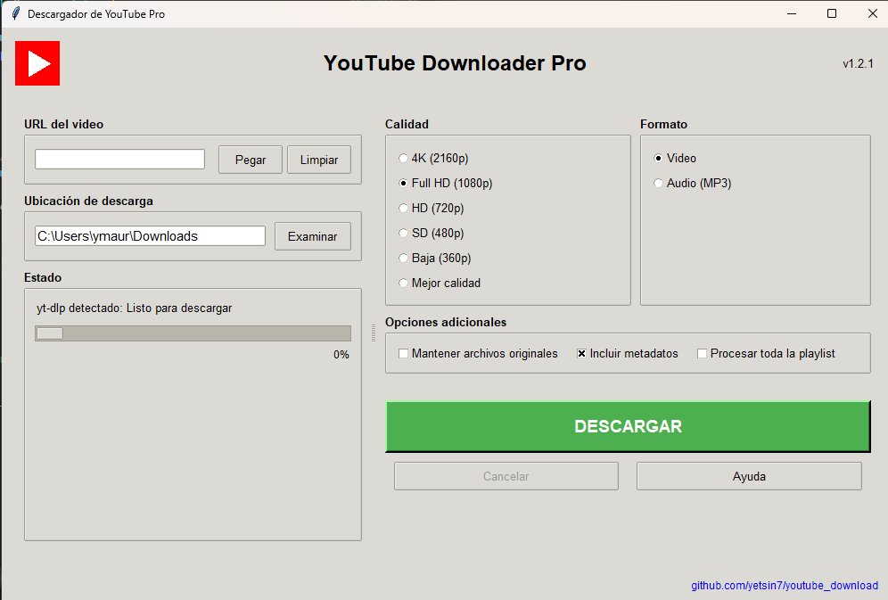

# 📥 YouTube Downloader Pro

## 🌟 Descripción
YouTube Downloader Pro es una aplicación de escritorio desarrollada en Python que permite descargar videos y audio de YouTube de manera fácil, rápida y con múltiples opciones de configuración.

  <!-- Agrega una captura de pantalla de tu aplicación -->

## ✨ Características
- 🎥 Descarga de videos en múltiples calidades (4K, Full HD, HD, SD)
- 🎵 Extracción de audio en formato MP3
- 🌈 Interfaz de usuario moderna e intuitiva
- 🔧 Opciones personalizables de descarga
- 📋 Soporte para descargas de videos individuales y playlists
- 💾 Selección personalizada de ubicación de descarga

## 🚀 Requisitos Previos
- Python 3.7+
- Tkinter
- yt-dlp
- FFmpeg (recomendado)

## 🔧 Instalación

### Dependencias
```bash
pip install tkinter yt-dlp
```

### Clonar el Repositorio
```bash
git clone https://github.com/tu-usuario/youtube-downloader.git
cd youtube-downloader
```

## 💻 Uso
```bash
python youtube_downloader.py
```

### Opciones de Uso
- Pegar URL de YouTube
- Seleccionar calidad de video
- Elegir formato (Video o Audio)
- Opciones adicionales:
  - Mantener archivos originales
  - Incluir metadatos
  - Descargar playlist completa

## 🤝 Contribuciones
¡Las contribuciones son bienvenidas! Por favor, sigue estos pasos:
1. Haz un Fork del proyecto
2. Crea tu rama de características (`git checkout -b feature/AmazingFeature`)
3. Confirma tus cambios (`git commit -m 'Add some AmazingFeature'`)
4. Empuja a la rama (`git push origin feature/AmazingFeature`)
5. Abre un Pull Request

## 📋 Licencia
Distribuido bajo la Licencia MIT. Consulte `LICENSE` para más información.

## 🛠️ Problemas Conocidos
- Requiere conexión a internet estable
- La descarga de videos muy largos puede tardar

## 🌐 Contacto
Tu Nombre - [Tu Email]

Enlace del Proyecto: https://github.com/yetsin7/youtube_download

---

⭐ Si te gusta el proyecto, ¡por favor dale una estrella!
